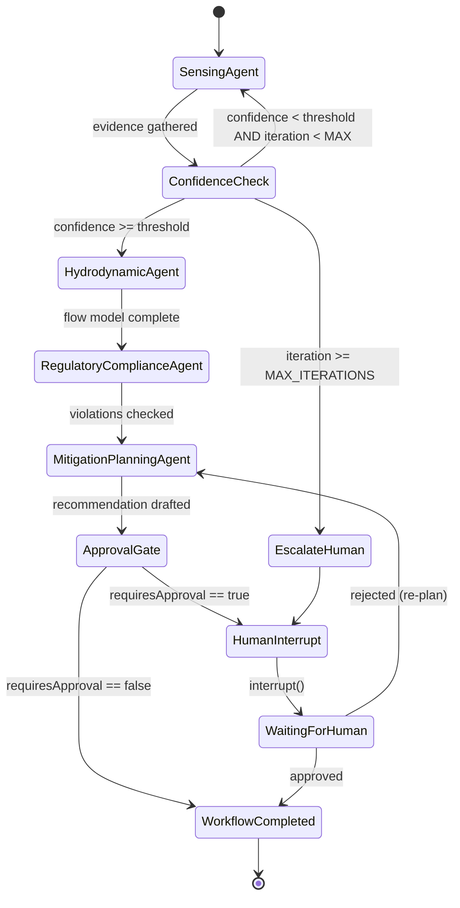
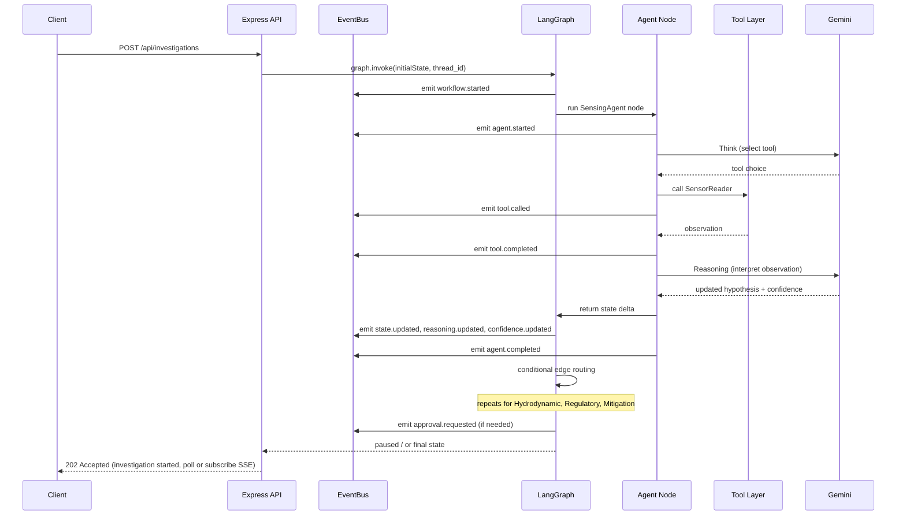

# PROJECT_ARCHITECTURE.md
## AquaSentinel — Autonomous Watershed Contamination Localization Swarm

Status: **Locked pre-implementation foundation.** No application code has been written yet.

---

## 1. Locked Architecture Decisions

These are fixed for the duration of the build. Any change requires explicit re-approval.

1. Exactly **4** specialist agents — Sensing, Hydrodynamic Reasoning, Regulatory Compliance, Mitigation Planning. No 5th agent.
2. Transport is **Server-Sent Events (SSE)**. No WebSockets.
3. **Mock datasets only.** The only live external API is Gemini.
4. **Single-page Mission Control dashboard.** No auth, no user management, no multi-tenancy.
5. **One LangGraph workflow (`StateGraph`).** No sub-graphs spawned as independent graphs — sub-routines are nodes/conditional edges inside the single graph.
6. Shared state uses **typed channels with explicit reducers** (Annotation/reducer pattern) — never a plain mutable object passed by reference.
7. Human approval uses LangGraph's **`interrupt()` / `Command(resume=...)`** pattern (TS equivalent of Python's interrupt-based HITL), backed by a checkpointer so the graph can pause and resume across HTTP requests.
8. Every feature must trace to a judging criterion (see Section 10). Anything that doesn't is out of scope for the hackathon build.

---

## 2. High-Level Architecture

```
┌──────────────────────────────────────────────────────────────────────┐
│                         CLIENT (Mission Control)                     │
│         (built independently — consumes REST + SSE only)             │
└───────────────▲───────────────────────────────────▲──────────────────┘
                 │ REST (JSON)                       │ SSE (text/event-stream)
┌───────────────┴───────────────────────────────────┴──────────────────┐
│                        EXPRESS API LAYER                             │
│  routes/investigations.ts   routes/approval.ts   routes/events.ts    │
│  routes/report.ts           routes/simulation.ts                     │
└───────────────┬────────────────────────────────────────────────────--┘
                 │ invokes / streams
┌───────────────▼────────────────────────────────────────────────────┐
│                       EVENT BUS  (events/EventBus.ts)               │
│   central pub/sub — every SSE client subscribes here                │
└───────────────▲──────────────────────────────────────────────────--─┘
                 │ emits (Workflow/Agent/Tool/State events)
┌───────────────┴────────────────────────────────────────────────────┐
│                    LANGGRAPH WORKFLOW (single StateGraph)           │
│                                                                      │
│   ┌────────────┐   ┌───────────────┐   ┌───────────────┐            │
│   │  Sensing   │──▶│ Hydrodynamic  │──▶│  Regulatory   │──▶ ...     │
│   │   Agent    │   │ Reasoning     │   │  Compliance   │            │
│   └─────┬──────┘   │   Agent       │   │    Agent      │            │
│         │           └───────┬───────┘   └───────┬───────┘           │
│         │                   │                   │                   │
│         ▼                   ▼                   ▼                   │
│                   SHARED STATE (reducer channels)                   │
│                                                   │                  │
│                                          ┌────────▼────────┐         │
│                                          │   Mitigation     │         │
│                                          │ Planning Agent   │         │
│                                          └────────┬────────┘         │
│                                                   │                  │
│                                    interrupt() ───┴──▶ HUMAN APPROVAL│
└───────────────┬───────────────────────────────────────────────────--┘
                 │ tool calls (ReAct loop)
┌───────────────▼──────────────────────────────────────────────────--─┐
│                          TOOL LAYER (mock)                          │
│  SensorReader · WeatherTool · SatelliteAnalysis · FactoryDatabase   │
│  ChemicalDatabase · HydrodynamicCalculator · IncidentReportGenerator│
└───────────────┬──────────────────────────────────────────────────--─┘
                 │ reads
┌───────────────▼──────────────────────────────────────────────────--─┐
│                    MOCK DATA LAYER (mock-data/*.json)                │
└───────────────────────────────────────────────────────────────────--┘
```

Gemini is called **inside** each agent node (reasoning step of the ReAct loop), not as a separate architectural layer — it's the LLM backing each agent's "Think" and "Reasoning" steps.

---

## 3. Component Diagram

| Component | Responsibility | Depends on |
|---|---|---|
| Express API layer | HTTP surface, request validation, kicks off / resumes graph runs | LangGraph workflow, EventBus |
| EventBus | Single source of truth for SSE broadcast; decouples graph execution from HTTP streaming | none (in-memory pub/sub) |
| LangGraph StateGraph | Orchestrates agent nodes, conditional routing, iteration control, checkpointing | Agent nodes, State reducers |
| Agent nodes (×4) | Domain reasoning + tool selection (ReAct loop) | Gemini API, Tool layer, Shared state |
| Tool layer | Deterministic mock functions agents call | Mock data layer |
| Mock data layer | Static/seeded JSON simulating sensors, weather, factories, watershed topology | none |
| Checkpointer | Persists graph state so `interrupt()` can pause execution across HTTP request boundaries | In-memory (MemorySaver) for hackathon scope |
| Scenario engine | Loads a named scenario and drives simulated telemetry ticks into a running investigation | Mock data layer |

---

## 4. Data Flow

```
1. Client: POST /api/investigations  { scenarioId }
2. Server: loads scenario → seeds initial telemetry → creates thread_id
3. Server: graph.invoke(initialState, { configurable: { thread_id } })
4. EventBus: "workflow.started"
5. Sensing Agent node runs:
     Think → select tool (SensorReader / SatelliteAnalysis)
       → Tool → Observation → Reasoning (Gemini call) → Decision
     EventBus: "agent.started" / "tool.called" / "tool.completed" / "agent.completed"
     State reducer merges: telemetry, evidence[], reasoningHistory[], confidence
6. Conditional edge: confidence >= threshold ? → Hydrodynamic Agent
                       confidence < threshold  ? → loop back to Sensing
                       (iteration++, capped at MAX_ITERATIONS)
7. Hydrodynamic Agent → Regulatory Compliance Agent → Mitigation Planning Agent
   (each following the same Think/Tool/Observation/Reasoning/Decision loop)
8. Mitigation Agent decides: requiresApproval = true/false
     if true → graph calls interrupt() → EventBus: "approval.requested"
               graph execution PAUSES, checkpoint persisted
9. Client: GET /api/investigations/:id  (poll state) — sees status: "awaiting_approval"
10. Client: POST /api/investigations/:id/approve  { decision: "approve" | "reject", notes? }
11. Server: graph.invoke(Command({ resume: decision }), { configurable: { thread_id } })
    → graph resumes from checkpoint
12. Final state reached → EventBus: "workflow.completed"
13. Client: GET /api/investigations/:id/report → Incident Report Generator tool output
```

---

## 5. Agent Communication Flow

Agents do **not** call each other directly. All communication happens through the shared state object, mediated by LangGraph's node/edge model. This is the mechanism that prevents state drift (Section 8).

```
Sensing Agent
   writes → state.telemetry, state.evidence[], state.confidence, state.reasoningHistory[]
      │
      ▼ (conditional edge reads state.confidence)
Hydrodynamic Reasoning Agent
   reads  ← state.telemetry, state.watershedNetwork, state.weather
   writes → state.affectedLocations[], state.evidence[], state.confidence
      │
      ▼
Regulatory Compliance Agent
   reads  ← state.affectedLocations[], state.factories[]
   writes → state.violations[], state.evidence[]
      │
      ▼
Mitigation Planning Agent
   reads  ← entire state (holistic decision)
   writes → state.recommendation, state.approvalStatus, state.requiresApproval
      │
      ▼
   interrupt() if requiresApproval === true
```

No agent ever mutates another agent's "owned" fields directly — each field in shared state has exactly one writer, enforced by the reducer design (Section 8).

---

## 6. LangGraph Workflow (Mermaid)



---

## 7. Backend Execution Flow (single request lifecycle)



---

## 8. The Hard Part — Engineering Solutions

| Problem | Solution |
|---|---|
| Prevent state drift | Every state field declared once with a single reducer function (e.g. `evidence: (a,b) => [...a, ...b]`, `confidence: (a,b) => b`). Agents return **deltas**, never the full state object — LangGraph merges via reducer, eliminating accidental overwrites. |
| Support continuous telemetry updates | `telemetry` is an append-with-cap reducer keyed by `sensorId + timestamp`; scenario engine pushes ticks via a dedicated `/simulate/tick` internal call that re-invokes the graph on the same `thread_id`. |
| Support repeated reasoning cycles | Conditional edge `ConfidenceCheck` routes back to `SensingAgent` while `confidence < CONFIDENCE_THRESHOLD` — implemented as a LangGraph conditional edge, not manual recursion. |
| Avoid infinite execution loops | Three independent ceilings: (1) `workflowIteration` counter capped at `MAX_ITERATIONS` (default 5) checked in the conditional edge; (2) per-agent `toolCallBudget` (default 4 calls/agent/iteration) enforced inside the ReAct loop; (3) wall-clock timeout per `graph.invoke()` call enforced in the API layer. Hitting any ceiling routes to `EscalateHuman`, never to a silent failure. |
| Checkpointing & recovery | LangGraph `MemorySaver` checkpointer keyed by `thread_id` (== investigationId). Enables `interrupt()`-based pausing and lets the server survive a mid-workflow crash and resume from last checkpoint (in-memory scope for hackathon; swappable for a persistent checkpointer later without changing agent code). |
| SSE ↔ graph decoupling | Central `EventBus` (Node `EventEmitter` wrapper) is the only thing agent/graph code talks to. The SSE route layer only subscribes to `EventBus` — graph code has zero knowledge of HTTP. |

---

## 9. Frontend Integration Flow (contract-level only — no frontend code here)

```
1. Frontend calls POST /api/investigations → gets investigationId
2. Frontend opens GET /api/events/:investigationId (SSE) → renders live agent/tool timeline
3. Frontend polls or listens for "approval.requested" → renders approval modal
4. Frontend calls POST /api/investigations/:id/approve
5. Frontend listens for "workflow.completed" → calls GET /api/investigations/:id/report
```

All of this is described exhaustively in `API_CONTRACT.md` and `EVENTS.md` — frontend dev needs nothing beyond those two files + `shared/types.ts` + the `mock-data/` folder to build the entire UI before backend integration.

---

## 10. Folder Structure

```
aquasentinel/
├── PROJECT_ARCHITECTURE.md
├── API_CONTRACT.md
├── EVENTS.md
├── DEVELOPMENT_ROADMAP.md
├── IMPLEMENTATION_CHECKLIST.md
├── README.md
├── shared/
│   └── types.ts
├── mock-data/
│   ├── mock-state.json
│   ├── mock-events.json
│   ├── mock-report.json
│   ├── mock-simulation.json
│   ├── mock-sensors.json
│   ├── mock-factories.json
│   ├── mock-weather.json
│   ├── mock-satellite-analysis.json
│   └── mock-watershed.json
└── backend/
    ├── package.json
    ├── tsconfig.json
    ├── .env.example
    └── src/
        ├── index.ts                     # Express app entry
        ├── config/
        │   └── env.ts
        ├── state/
        │   ├── channels.ts              # reducer definitions
        │   └── initialState.ts
        ├── graph/
        │   ├── graph.ts                 # StateGraph assembly
        │   ├── nodes/
        │   │   ├── sensingAgent.ts
        │   │   ├── hydrodynamicAgent.ts
        │   │   ├── regulatoryAgent.ts
        │   │   └── mitigationAgent.ts
        │   └── edges/
        │       └── conditionalRouting.ts
        ├── agents/
        │   └── reactLoop.ts             # shared Think/Tool/Observation/Reasoning helper
        ├── tools/
        │   ├── sensorReader.ts
        │   ├── weatherTool.ts
        │   ├── satelliteAnalysis.ts
        │   ├── factoryDatabase.ts
        │   ├── chemicalDatabase.ts
        │   ├── hydrodynamicCalculator.ts
        │   └── incidentReportGenerator.ts
        ├── events/
        │   └── EventBus.ts
        ├── routes/
        │   ├── investigations.ts
        │   ├── approval.ts
        │   ├── events.ts
        │   ├── report.ts
        │   └── simulation.ts
        ├── scenarios/
        │   └── scenarioEngine.ts
        └── utils/
            └── logger.ts
```

A skeleton of this tree (empty directories) has been generated alongside this document for reference.

---

## 11. Architectural Decision Traceability Matrix

Every structural decision mapped to theme keywords, SDGs, and judging criteria.

| Decision | Autonomous | Watershed | Contamination | Localization | Swarm | SDG 6 | SDG 14 | Core Feature | Hard Part |
|---|:---:|:---:|:---:|:---:|:---:|:---:|:---:|:---:|:---:|
| 4 independent specialist agents | ✓ | | | ✓ | ✓ | | | Specialist Agent Architecture | |
| Conditional confidence-loop edge | ✓ | | ✓ | ✓ | | | | ReAct + Shared State | ✓ |
| Hydrodynamic Agent + flow calculator tool | | ✓ | ✓ | ✓ | | ✓ | ✓ | Specialist agent | |
| Reducer-based state channels | ✓ | | | | ✓ | | | Shared State | ✓ (drift) |
| Iteration + tool-call + timeout ceilings | ✓ | | | | | | | Guardrails | ✓ (loops) |
| `interrupt()` human approval gate | | | | | | ✓ | ✓ | Human-in-the-loop | |
| Regulatory Compliance Agent | | ✓ | ✓ | ✓ | ✓ | ✓ | | Specialist agent | |
| Mock Chemical Database tool | | | ✓ | | | ✓ | ✓ | ReAct tools | |
| EventBus + SSE taxonomy | ✓ | | | | ✓ | | | Live Observability | |
| Checkpointing (MemorySaver) | ✓ | | | | | | | LangGraph | ✓ (recovery) |
| Scenario engine w/ continuous telemetry ticks | ✓ | ✓ | ✓ | | | | | Core simulation | ✓ (continuous updates) |
| Single StateGraph (no sub-graphs) | | | | | ✓ | | | Architecture constraint | |

No feature exists outside this table — anything proposed later must earn a row here before implementation.
